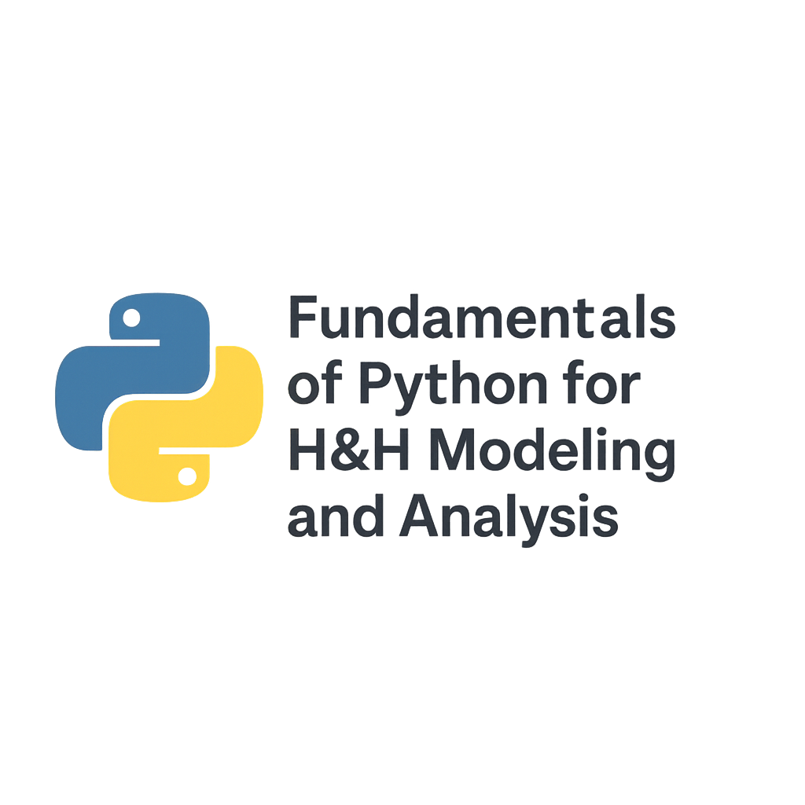

<p align="center">
  
</p>

# Fundamentals of Python for H&H Modeling and Analysis

A practical Python course for water resources engineers.

---

## About

This course teaches Python programming fundamentals through real hydrologic and hydraulic engineering workflows. It is designed for water resources professionals who already understand H&H concepts but want practical, usable Python skills without becoming software engineers.

Instead of abstract coding exercises, the course focuses on real tasks engineers deal with every day: working with time series, spatial vector and raster data, stream and gage data, and precipitation datasets. The emphasis is on writing clear, readable code and using Python to replace spreadsheets, automate repetitive tasks, and build reproducible analyses.

The course also recognizes that AI and large language models have fundamentally changed how engineers write, read, and understand code. Rather than ignoring these tools, the course shows how to use them responsibly and effectively to accelerate learning, explore unfamiliar libraries, debug workflows, and improve code quality—while still maintaining engineering judgment and accountability.

By the end of the course, you will be comfortable using Python and modern AI-assisted workflows as everyday tools to support hydrologic and hydraulic modeling, data analysis, and decision-making in real-world engineering practice.

---

## Course Modules

| Module | Topic |
|--------|-------|
| 01 | Setup and Fundamentals |
| 02 | Time Series |
| 03 | Vector Data |
| 04 | Raster Data |
| 05 | Stream Data |
| 06 | Precipitation Data |

---

## Repository Structure

```
├── figures/
├── notebooks/
│   ├── 01_setup_and_fundamentals/
│   ├── 02_timeseries/
│   ├── 03_vector-data/
│   ├── 04_raster-data/
│   ├── 05_stream-data/
│   └── 06_precip-data/
├── .gitignore
└── README.md
```

---

## Getting Started

1. Clone this repository
2. Set up your Python environment (instructions in Module 01)
3. Work through the notebooks in order

---

## License

*License information here*

---

## Author

Mohsen Tahmasebi Nasab, PhD  
[hydromohsen.com](https://hydromohsen.com)
