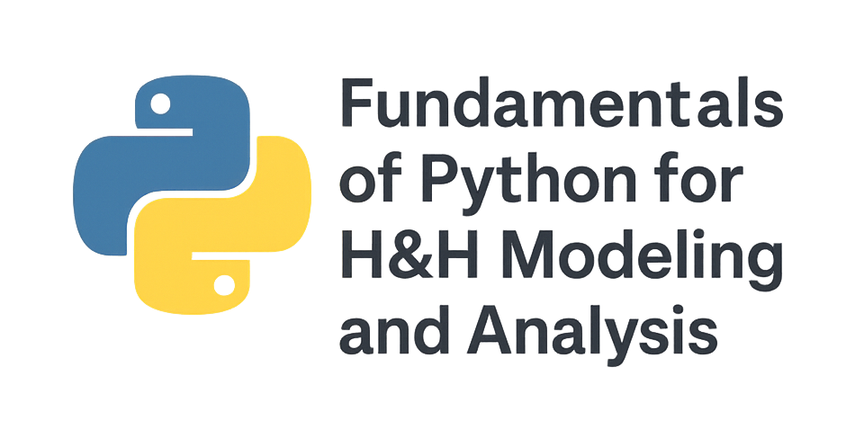
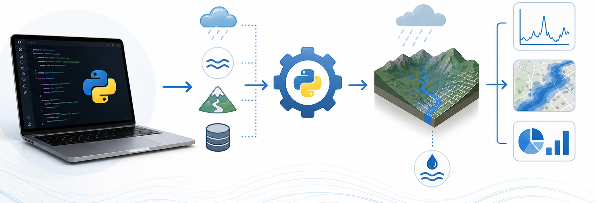

<p align="center">
  
</p>

<p align="center">
  
</p>

<h1 align="center">Fundamentals of Python for H&H Modeling and Analysis</h1>

<p align="center">
  <strong>A practical Python course for water resources engineers</strong>
</p>

<p align="center">
  <a href="#-about">About</a> •
  <a href="#-course-modules">Modules</a> •
  <a href="#-getting-started">Getting Started</a> •
  <a href="#-contributing">Contributing</a> •
  <a href="#-license">License</a>
</p>

<p align="center">
  
  
  
</p>

---

## About

This course teaches Python programming fundamentals through **real hydrologic and hydraulic engineering workflows**. It is designed for water resources professionals who already understand H&H concepts but want practical, usable Python skills without becoming software engineers.

### What Makes This Course Different

**Real-World Focus**  
Instead of abstract coding exercises, the course focuses on real tasks engineers deal with every day: working with time series, spatial vector and raster data, stream and gage data, and precipitation datasets.

**Clarity Over Complexity**  
The emphasis is on writing clear, readable code and using Python to replace spreadsheets, automate repetitive tasks, and build reproducible analyses.

**AI-Enhanced Learning**  
The course recognizes that AI and large language models have fundamentally changed how engineers write, read, and understand code. Rather than ignoring these tools, the course shows how to use them responsibly and effectively to accelerate learning, explore unfamiliar libraries, debug workflows, and improve code quality, while still maintaining engineering judgment and accountability.

### What You'll Learn

By the end of the course, you will feel comfortable using Python and modern LLM-assisted workflows as everyday tools to support hydrologic and hydraulic modeling, data analysis, and decision-making in real-world engineering practice.

---

## Course Modules

<table>
  <thead>
    <tr>
      <th width="80">Module</th>
      <th>Topic</th>
      <th width="100">Level</th>
      <th width="100">Status</th>
    </tr>
  </thead>
  <tbody>
    <tr>
      <td align="center"><strong>01</strong></td>
      <td><a href="https://github.com/mohsennasab/python-fundamentals-hh/tree/main/notebooks/01_setup_and_fundamentals">Setup and Fundamentals</a></td>
      <td align="center">Beginner</td>
      <td align="center">✅ Available</td>
    </tr>
    <tr>
      <td align="center"><strong>02</strong></td>
      <td><a href="https://github.com/mohsennasab/python-fundamentals-hh/tree/main/notebooks/02_timeseries">Time Series</a></td>
      <td align="center">Beginner</td>
      <td align="center">✅ Available</td>
    </tr>
    <tr>
      <td align="center"><strong>03</strong></td>
      <td><a href="https://github.com/mohsennasab/python-fundamentals-hh/tree/main/notebooks/03_vector-data">Vector Data</a></td>
      <td align="center">Beginner</td>
      <td align="center">✅ Available</td>
    </tr>
    <tr>
      <td align="center"><strong>04</strong></td>
      <td><a href="https://github.com/mohsennasab/python-fundamentals-hh/tree/main/notebooks/04_raster-data">Raster Data</a></td>
      <td align="center">Beginner</td>
      <td align="center">✅ Available</td>
    </tr>
    <tr>
      <td align="center"><strong>05</strong></td>
      <td><a href="https://github.com/mohsennasab/python-fundamentals-hh/tree/main/notebooks/05_stream-data">Stream Data</a></td>
      <td align="center">Beginner</td>
      <td align="center">✅ Available</td>
    </tr>
    <tr>
      <td align="center"><strong>06</strong></td>
      <td><a href="https://github.com/mohsennasab/python-fundamentals-hh/tree/main/notebooks/06_precip-data">Precipitation Data</a></td>
      <td align="center">Beginner</td>
      <td align="center">✅ Available</td>
    </tr>
  </tbody>
</table>

**Difficulty Levels:**

| Level | Description |
|-------|-------------|
| **Beginner** | No prior Python experience needed. Concepts are explained from scratch with H&H analogies. |
| **Intermediate** | Assumes comfort with Python basics (variables, loops, functions, pandas). Focuses on applied workflows. |
| **Advanced** | Assumes working knowledge of Python and H&H modeling tools. Covers automation, optimization, or integration with professional software. |

> More modules and lessons will be added to this course over time!

---

## What Participants Are Saying

> *"As a complete beginner to Python/Google Colab, the course was approachable and could be completed successfully."*

> *"This is an excellent course for beginners, particularly by highlighting where and how AI can assist."*

> *"The progression through each part, lesson, and module is very clear. The use of structured analogies and AI assistant subheadings is effective."*

> *"This is a strong, discipline-focused introduction to scripting and automation. It also demonstrates practical examples for each data type commonly used."*

> *"Step-by-step examples followed by small exercises are very helpful. The streamflow retrieval exercise is especially useful."*

Participants have also suggested directions for future modules, including GIS software integration (running Python tools inside QGIS), working with HDF5 data formats, and building reusable pipeline templates for probabilistic and simulation-based modeling. These ideas are shaping the roadmap for upcoming content.

---

## Repository Structure

```
python-fundamentals-hh/
├── figures/              # Course images and diagrams
├── notebooks/            # Interactive Colab notebooks
│   ├── 01_setup_and_fundamentals/
│   ├── 02_timeseries/
│   ├── 03_vector-data/
│   ├── 04_raster-data/
│   ├── 05_stream-data/
│   └── 06_precip-data/
├── presentation.html     # Course introduction presentation
├── .gitignore
└── README.md
```

---

## Getting Started

### Video Tutorial

The video below gives an introduction on how to get started with this course:

<p align="center">
  <a href="https://youtu.be/XCqIm18dVT4">
    
  </a>
</p>

<p align="center">
  <strong>▶️ <a href="https://youtu.be/XCqIm18dVT4">Getting Started Video</a></strong><br>
  <em>A short walkthrough on how to use this repository, open notebooks in Google Colab, and follow the course structure.</em>
</p>

### Quick Start Steps

1. **Download** this repository or work online
2. **Set up** your Python environment (instructions in Module 01)
3. **Work through** the notebooks in order

---

## Author

<table>
  <tr>
    <td align="center">
      <strong>Mohsen Tahmasebi Nasab, PhD</strong><br>
      <em>Water Resources Engineer</em><br><br>
      🌐 <a href="https://hydromohsen.com">hydromohsen.com</a><br>
      📺 <a href="https://www.youtube.com/@HydroMohsen">YouTube Channel</a>
    </td>
  </tr>
</table>

### Support This Course

If you enjoyed this course and found it useful, consider keeping me caffeinated so I can create more content like this!

<p align="center">
  <a href="https://buymeacoffee.com/HydroMohsen" target="_blank">
    
  </a>
</p>

---

## Contributing

Contributions are welcome and encouraged! This course grows through community input from practicing engineers and researchers.

### How to Contribute

1. **Open an issue** to propose your lesson idea before writing code
2. **Fork** the repository and create your lesson in a feature branch
3. **Submit a pull request** with your completed notebook
4. After review and acceptance, your module will be published **with your name as the contributor**

### Module Requirements

Every contributed module **must** meet the following criteria to be accepted:

#### Structure

Each notebook must include the following sections at the top:

| Section | What to Include |
|---------|----------------|
| **Lesson Level** | One of: Beginner, Intermediate, or Advanced (see definitions above) |
| **Purpose** | A short paragraph explaining why this lesson exists and where it fits in the course |
| **Learning Objectives** | A concise bullet list of what learners should be able to do by the end |
| **Prerequisites** | Reference prior modules or skills assumed (if any) |
| **AI Prompts** | Include at least 2-3 practical AI prompt examples that help learners understand, debug, or extend the code |

#### Content Standards

- **Use real H&H examples.** Every code example should relate to hydrology, hydraulics, or water resources engineering. No generic programming exercises.
- **Prefer clarity over cleverness.** Write code that a first-time Python user can follow. If a one-liner is hard to read, break it into multiple lines with comments.
- **Include sample data.** Provide any data files needed to run the notebook. Place them in a `data/` subfolder within your module directory. Make sure your sample data does not include any information you don't want to share publically. 
- **Test in Google Colab.** All notebooks must run successfully in a fresh Colab session with no local dependencies beyond `pip install`.
- **Show AI-assisted workflows.** Demonstrate how learners can use AI tools (ChatGPT, Claude, Gemini, Copilot) to understand and extend the code. Include practical prompts they can copy and use.
- **Keep the tone friendly and human.** Write as if you're explaining to a colleague, not writing a textbook. Avoid overly formal language and excessive emoji.

#### What Makes a Good Module Proposal

Strong proposals typically:
- Address a workflow that H&H engineers do regularly (e.g., frequency analysis, rating curve development, flood mapping)
- Build on skills from existing modules without duplicating them
- Include a real dataset that learners can work with
- Have a clear "before and after" — show what the manual process looks like and how Python improves it

#### Review Process

1. A maintainer will review your pull request for technical correctness, clarity, and adherence to the standards above
2. You may receive feedback requesting changes. This is normal and collaborative
3. Once approved, your module will be merged and your name will appear as a contributor
4. All accepted contributions are published under the course license (see below)

---

## More H&H Python Tools to Explore

This course covers the fundamentals. The open-source H&H community has built many other Python tools worth knowing as your work grows. Below are actively maintained projects you can explore once you're comfortable with the material in this course.

| Tool | Description |
|------|-------------|
| [HyRiver](https://github.com/hyriver/HyRiver) | Unified Python access to USGS, NHD, 3DEP, NLDAS, Daymet, NID, and more |
| [dataretrieval-python](https://github.com/DOI-USGS/dataretrieval-python) | Official USGS NWIS data retrieval library (used in Module 5) |
| [pysheds](https://github.com/mdbartos/pysheds) | Watershed delineation, flow accumulation, and stream networks from DEMs |
| [pyflwdir](https://github.com/Deltares/pyflwdir) | Flow direction, upstream area, and river network analysis from elevation grids |
| [SPOTPY](https://github.com/thouska/spotpy) | Calibration, sensitivity analysis, and uncertainty estimation for hydrologic models |
| [hydroeval](https://github.com/ThibHlln/hydroeval) | NSE, KGE, PBIAS, and other model performance metrics in one library |
| [Pastas](https://github.com/pastas/pastas) | Time series analysis of groundwater levels with stress models |
| [xclim](https://github.com/Ouranosinc/xclim) | Climate indicators and indices for precipitation, temperature, and droughts |
| [RAS Commander](https://github.com/gpt-cmdr/ras-commander) | Python automation and orchestration for HEC-RAS models |
| [xarray](https://github.com/pydata/xarray) | Labeled multidimensional arrays for NetCDF, GRIB, and gridded climate data |
| [hvplot](https://github.com/holoviz/hvplot) | Interactive hydrograph and spatial plots with one-line syntax over pandas and xarray |
| [noaa_coops](https://github.com/GClunies/noaa_coops) | NOAA CO-OPS tides, currents, and water level data retrieval |

Have a tool you'd recommend? Open an issue or a pull request and we'll add it to the list.

---

## License

This project is released under a **custom open-source license** for individual educational use.

<details>
<summary>View Full License</summary>

```
Open Source License for Individual Use

Copyright (c) 2025 Mohsen Tahmasebi Nasab

Permission is hereby granted, free of charge, to any individual obtaining a
copy of this software and associated documentation files (the "Course
Materials"), to use, copy, modify, and share the Course Materials for personal
learning, education, and non-commercial purposes, subject to the following
conditions:

1. INDIVIDUAL USE: The Course Materials may be freely used by individuals for
   self-study, personal skill development, and educational purposes.

2. ATTRIBUTION: Any redistribution or derivative work must include attribution
   to the original author and a link to the original repository at
   https://github.com/mohsennasab/python-fundamentals-hh

3. NON-COMMERCIAL: The Course Materials may not be sold, licensed, or used as
   part of any paid training program, commercial product, or for-profit service
   without prior written permission from the copyright holder.

4. CONTRIBUTIONS: By submitting a contribution (pull request) to this
   repository, you agree that your contribution will be published under these
   same license terms, with attribution to you as the contributor.

5. SHARE-ALIKE: Any modified versions or derivative works that are distributed
   must be shared under these same license terms.

THE COURSE MATERIALS ARE PROVIDED "AS IS", WITHOUT WARRANTY OF ANY KIND,
EXPRESS OR IMPLIED, INCLUDING BUT NOT LIMITED TO THE WARRANTIES OF
MERCHANTABILITY, FITNESS FOR A PARTICULAR PURPOSE AND NONINFRINGEMENT. IN NO
EVENT SHALL THE AUTHORS OR COPYRIGHT HOLDERS BE LIABLE FOR ANY CLAIM, DAMAGES
OR OTHER LIABILITY, WHETHER IN AN ACTION OF CONTRACT, TORT OR OTHERWISE,
ARISING FROM, OUT OF OR IN CONNECTION WITH THE COURSE MATERIALS OR THE USE OR
OTHER DEALINGS IN THE COURSE MATERIALS.
```

</details>

**In plain English:** You are free to use, study, and share this course for personal and educational purposes. If you redistribute or build on it, give credit and keep it open. For commercial use (paid workshops, corporate training programs, etc.), please reach out for permission first.

---

<p align="center">
  <sub>Star this repo if you find it helpful!</sub>
</p>
